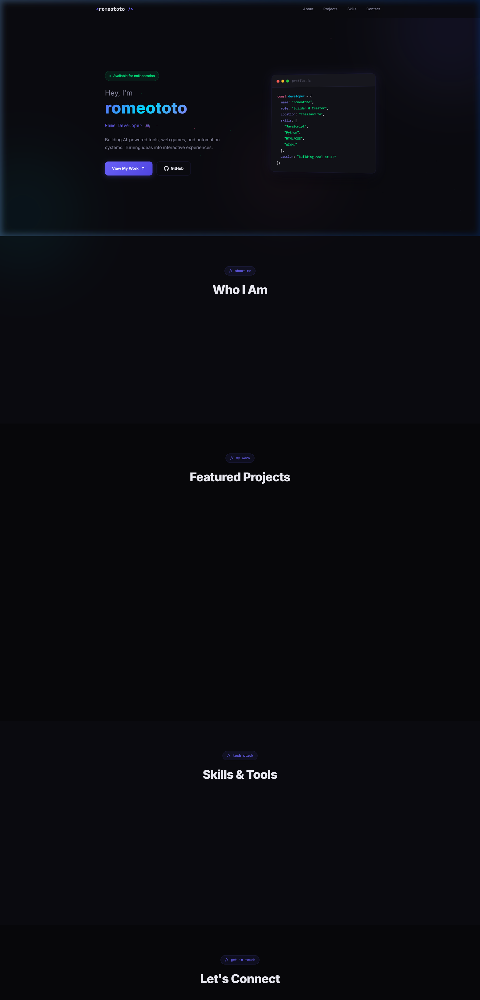

<div align="center">

# 🌐 RoMEoTOTO — Personal Portfolio

### Premium Developer Portfolio Website

[](https://romeototo.github.io/portfolio-website/)
[](LICENSE)



</div>

---

## 📖 About

A premium personal portfolio website built with pure HTML, CSS, and JavaScript — no frameworks needed. Features a sleek dark theme with glassmorphism effects, smooth scroll-reveal animations, and an interactive particle background.

## ✨ Features

- 🎨 **Dark Theme** — Elegant dark design with custom CSS variables
- 🪟 **Glassmorphism** — Frosted glass UI elements with backdrop blur
- ✨ **Particle Background** — Dynamic animated particle system in the hero section
- ⌨️ **Typewriter Effect** — Animated role text in the hero section
- 🎞️ **Scroll-Reveal Animations** — Smooth fade-in effects as you scroll
- 📱 **Fully Responsive** — Works on desktop, tablet, and mobile
- 🚀 **No Frameworks** — Pure HTML/CSS/JS, fast & lightweight
- 📊 **SEO Optimized** — Meta tags, semantic HTML, and proper structure

## 🛠️ Tech Stack


- **Structure:** Semantic HTML5
- **Styling:** Custom CSS3 with CSS variables, Flexbox, Grid
- **Animations:** Vanilla JS + CSS transitions
- **Font:** Google Fonts (Inter)
- **Hosting:** GitHub Pages

## 🚀 Live Demo

👉 **[romeototo.github.io/portfolio-website](https://romeototo.github.io/portfolio-website/)**

## 💻 Run Locally

```bash
git clone https://github.com/romeototo/portfolio-website.git
cd portfolio-website
# Open index.html in your browser
```

## 📂 Project Structure

```
portfolio-website/
├── index.html          # Main HTML structure
├── style.css           # All styles & design system
├── script.js           # Interactive JS (particles, typewriter, etc.)
├── assets/
│   └── screenshots/    # Preview images
└── LICENSE
```

## 📄 License

This project is licensed under the [MIT License](LICENSE).

---

<div align="center">

**Made with ❤️ by [RoMEoTOTO](https://github.com/romeototo)**

[](https://romeototo.github.io/portfolio-website/)
[](https://x.com/RoMeoT0T0)
[](https://github.com/romeototo)

</div>
